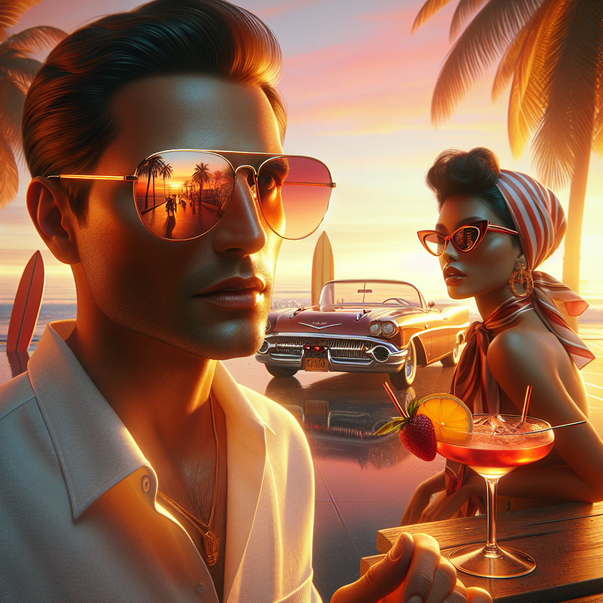

# 🕶️ Summer Sunglasses Campaign – Executive Summary

## 📊 Refined Trend Insights
Trend Briefing | December 14, 2025

Overview  
As we finalize our Summer 2025 campaign, three eyewear movements are commanding attention—and sales. Our catalog’s top‐performing Aviator and Mystique styles align perfectly with these shifts, positioning us to drive both broad appeal and exclusive urgency.

1. Key Summer 2025 Eyewear Trends  
• Aviator Revival  
  – The classic teardrop shape is back in favor, seen across TikTok and top-tier influencers. Modern tweaks include slimmer metal rims and soft gradient lenses—delivering a familiar yet fresh look.  
• Retro-Inspired Silhouettes  
  – From ’50s cat-eyes to ’60s ovals and the early-2000s “Matrix” aesthetic, vintage acetate frames and temple accents are experiencing renewed demand among fashion-forward consumers.  
• Futuristic Oversized Shields  
  – Single-lens wraparounds—mirrored or color-tinted, often with geometric cutouts—are dominating street-style and festival wardrobes, fueling the “future-sport” trend.

2. Catalog Highlights  
• SG001 “Aviator” (23 units)  
  – Timeless teardrop lenses paired with a lightweight metal frame. Perfectly captures the Aviator Revival and suits all-day summer wear.  
• SG003 “Mystique” (3 units)  
  – A refined 1950s cat-eye in polished acetate. Its sculpted corners and premium finish deliver on the retro-inspired demand—and its scarcity creates instant desirability.

3. Campaign Rationale  
• Brand Synergy: Both styles leverage instantly recognizable silhouettes, streamlining influencer partnerships and consumer adoption.  
• Broad Appeal + Exclusivity: Aviators offer unisex versatility across casual and formal summer looks. Mystique’s limited availability positions it as a high-impact, must-own drop.  
• Inventory Strategy: With ample Aviators to anchor core promotions and a tight Mystique run to ignite social buzz, we’ll maximize sell-through and brand relevance this summer.

Next Steps  
Launch core Aviator content across paid and organic channels. Schedule a limited Mystique preview drop with influencer seeding to drive urgency. Monitor engagement metrics for real-time optimization.

## 🎯 Campaign Visual

    

## ✍️ Campaign Quote
Sunset Revival: Aviators & Cat-Eyes Spark Timeless Summer Style

## ✅ Why This Works
The image’s golden-hour glow highlights both the classic teardrop aviator and vintage cat-eye silhouettes. This quote captures the dual trend of aviator revival and retro-inspired shapes, while invoking the resort-chic summer mood that drives urgency around limited-edition and versatile stock.

---

*Report generated on 2025-12-14*
