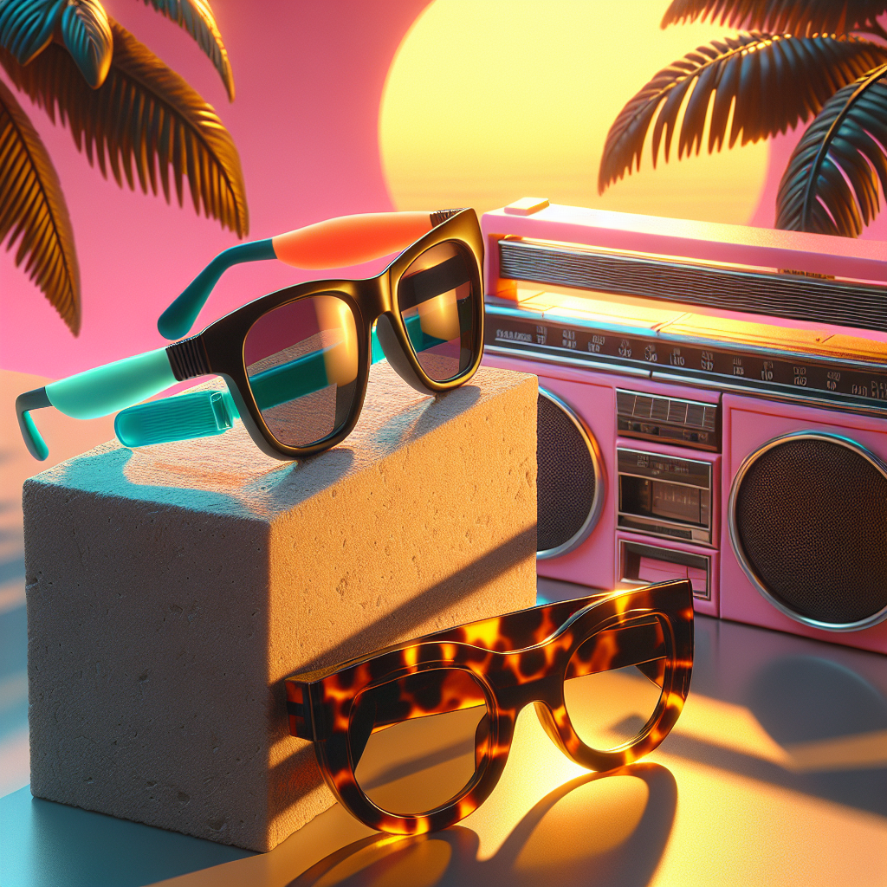

# 🕶️ Summer Sunglasses Campaign – Executive Summary

## 📊 Refined Trend Insights
Executive Trend Brief: Summer 2025 Eyewear

As we prepare for our Summer 2025 campaign, three distinct eyewear trends have emerged as market drivers. By aligning our core styles to these movements, we can capture diverse customer segments, maximize sell-through, and reinforce our brand’s fashion leadership.

1. Market Trends  
 • Wraparound Sport Shades  
   – Single-lens, high-coverage designs with a futurist, performance-driven aesthetic  
   – Endorsed by Vogue street-style reports and TheStyleClat as the season’s “must-wear” look  
 • ’90s-Era Chunky Frames  
   – Oversized acetate silhouettes evoking Y2K nostalgia and “cool-girl” confidence  
   – Spotlighted by Byrdie and InStyle in their retro-revival features  
 • Minimalist Wire/Thin-Acetate Frames  
   – Understated, lightweight constructions that speak to quiet luxury and elevated simplicity  
   – Forecast by leading fashion authorities for discerning, style-focused shoppers  

2. Our Key Product Matches  
 • SG004 “Sport” Wraparounds  
   – Single curved lens, rubber nose grips and ultra-light flexible frame  
   – Delivers high performance and everyday wearability for active consumers  
 • SG002 “Wayfarer” Bold Acetate  
   – Thick, angular profile in premium acetate  
   – Infuses retro attitude for fashion-forward audiences seeking statement pieces  
 • SG005 “Round” Minimalist Frames  
   – Slim metal/acrylic rims with classic round lenses  
   – Perfect entry point to the quiet-luxury segment, combining elegance with ease  

3. Strategic Rationale  
 • Comprehensive Coverage:  
   – Addresses three leading segments—sport performance, street-style nostalgia and elevated minimalism—under one campaign umbrella.  
 • Broad Market Appeal:  
   – Targets active lifestyles with SG004, trendsetters with SG002 and luxury-leaning buyers with SG005.  
 • Ready for Rapid Rollout:  
   – Current stock levels (11, 6 and 10 units) and competitive price points ($144, $92, $86) create immediate opportunities for hero-SKU promotions, bundle offers and precision-targeted advertising.  

By positioning these products at the forefront of our Summer 2025 messaging, we can drive engagement across multiple consumer profiles, optimize inventory turnover and reinforce our reputation for trend-leading design.

## 🎯 Campaign Visual

    

## ✍️ Campaign Quote
Beyond the Sun: Retro Style, Futuristic Edge

## ✅ Why This Works
The vibrant neon sunset, chunky tortoiseshell Wayfarer and sleek wraparound frames in the image perfectly capture both ’90s nostalgia and F1-inspired performance—aligning with summer’s top trends in bold retro attitude and futuristic sport design.

---

*Report generated on 2025-12-14*
